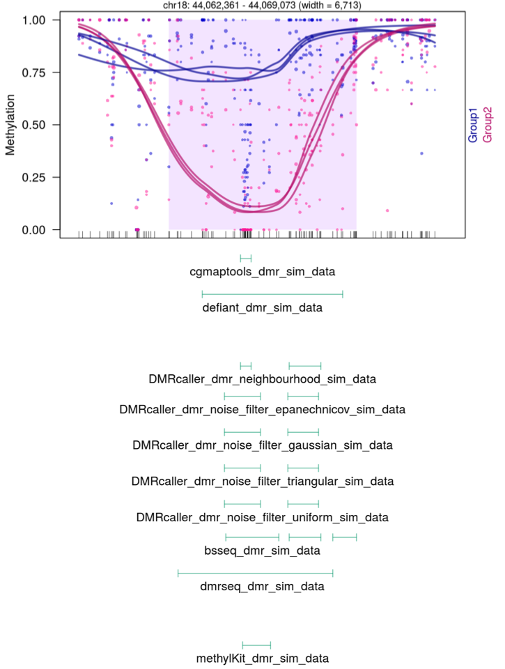

# Introduction{#introduction}
## DNA methylation{#dna_methylation}

DNA methylation (DNAme) is a process by which methyl groups are added to the DNA molecule. Methylation could change the activity of the DNA without changing its code. It serves as a critical phenomenon to several biological functions and has a role in certain disease states. Further, DNAme is a privileged candidate for epigenetic inheritance due to its plasticity and stability across mitosis and meiosis. It is one of the major mechanisms of epigenetic modification and has a fundamental influence on gene expression, genomic stability and cellular activity [@Leek2010; @Lavie2004].

With the advancement of next-generation (NGS) sequencing techniques, there are several methods for studying DNA methylation, but, few offer a better resolution of methylation status such as bisulfite sequencing (also known as Bisulfite-Seq, BS-Seq, Methyl-Seq or WGBS). The key idea of the method is combining the power of high-throughput DNA sequencing with the treatment of DNA with sodium bisulfite.


## Whole Genome Bisulphite Sequencing{#whole_genome_bisulphite_sequencing}

Whole Genome Bisulphite Sequencing (WGBS) is a gold standard NGS technique for studying DNAme in the genome of mammals. WGBS combines sodium bisulfite conversion of the DNA sequence with high throughput DNA sequencing. The sodium bisulfite reaction converts the unmethylated cytosines (C) to uracils (U), whereas, methylated C remains unchanged. These U are further converted to thymine (T) after the polymerase chain reaction (PCR). Although, no change occurs for methylated C. Methylcytosines are the methylated versions of the cytosine bases. This is done by transferring a methyl group onto the C5 position of the cytosine.

The aim of NGS-based DNA methylation analysis is to investigate genomic DNA and find out whether single cytosines or entire regions in the genome are methylated or not. WGBS is the most comprehensive sequencing for DNA methylation profiling, allowing single-base resolution of 5-mC within the whole genome. By comparing treated and untreated sequences, the location of the methylated cytosines is determined.


**There are several applications of WGBS, including (not limited to):**

- detection of differentially methylated regions (DMRs)

- detection of differentially methylated locis (DMLs)

- detection of copy number variations (CNVs)

- detection of single nucleotide polymorphisms (SNPs)

- detection of cytosine methylation levels of transcription factor binding sites (TFBSs)

- detecting methylation level or distribution (globally, single nucleotide, chromosome-wide and gene-centric)

Sequencing the whole genome is generally quite expensive. Therefore, although it has been applied to large genomes such as the human genome, large numbers of individual samples are seldom sequenced. Reduced representation bisulfite sequencing (RRBS) has been developed for this reason, in which the bisulfite reaction occurs but the sequencing is limited to around 1% of the genome. This enables the sequencing of the genome of several individuals.


## Basic pipeline for WGBS data analysis{#basic_pipeline_for_wgbs_data_analysis}

```{r, echo=T, message=F, fig.align='center', fig.height=5, fig.width=6, fig.cap="Figure 1. Basic pipeline for WGBS data analysis."}
library(DiagrammeR)
grViz("
digraph flowchart {
graph [overlap = true, layout=dot,fontsize=12]

node [shape = box, style=filled, fillcolor=NavajoWhite, color=DarkslateGray, fontsize=12];
A; B; E; F; G;
node [shape = egg, style=filled, fillcolor=NavajoWhite, color=DarkslateGray, fontsize=12];
C; D;

A [label='Quality Check: FastQC']
B [label='Quality Control: trim_galore']
C [label='Alignment: Bismark']
D [label='Methylation extraction: Bismark']
E [label='Overview of QC: MultiQC']
F [label='Differential analysis: DMLs']
G [label='Differential analysis: DMRs']
edge[color=DarkslateGray,
  penwidth=5
]
A->B
B->C[label = '  trim adapters, remove shorter reads, trim Ns']
C->D
C->E
A->E
B->E
D->F[label = '  DMLs: single basepair resolution']
D->G[label = '  DMRs: identify regions']
}
")
```
<br>
<br>

## Limitations of current methods{#limitations_of_current_methods}

- Methods are greatly hindered by low sample size. Most of the methods depend on large sample sizes.

- The number of tests performed = the number of loci analyzed. Example: Human genome has ~30 million CpGs [@Smith2013].

- Measurements are spatially correlated across the genome [@Leek2010], but in most methods measurements from all loci are treated independently.

- Multiple testing corrections without considering the spatial correlation can result in a loss of power.

- DMRs more biologically relevant than DMLs.

- DML approaches may construct DMRs by chaining together neighboring significant loci, but this type of approach will not yield a proper assessment of the statistical significance of the constructed regions, nor will the FDR be properly controlled [@Robinson2014].

- Controlling the FDR at the level of individual loci is not the same as controlling FDR of regions.

- Methylation data cannot be modeled either by Gaussian models (due to low coverage) or by Binomial models (do not account for biological variability). Beta-Binomial models are computationally difficult.

## Challenges for assessing DMRs{#challenges_for_assessing_dmrs}

- defining region boundaries

- methods ignore correlation across loci

- biological variability from sample to sample

- should be powerful even in the case of 2 samples per group.


# Methods{#methods}

## Data{#data}

**Two data sets were used in this project.**

**First**, representing negative control (with no expected DMRs), contained six methylation profiling samples from normal human dendritic cells ([data in GEO](https://www.ncbi.nlm.nih.gov/geo/query/acc.cgi?acc=GSE64177)). The samples were artificially divided into two groups of three samples, **Group1** consisting of samples [GSM1565940](https://www.ncbi.nlm.nih.gov/geo/query/acc.cgi?acc=GSM1565940), [GSM1565944](https://www.ncbi.nlm.nih.gov/geo/query/acc.cgi?acc=GSM1565944), and [GSM1565948](https://www.ncbi.nlm.nih.gov/geo/query/acc.cgi?acc=GSM1565948), **Group2** consisting of samples [GSM1565942](https://www.ncbi.nlm.nih.gov/geo/query/acc.cgi?acc=GSM1565942), [GSM1565946](https://www.ncbi.nlm.nih.gov/geo/query/acc.cgi?acc=GSM1565946), and [GSM1565950](https://www.ncbi.nlm.nih.gov/geo/query/acc.cgi?acc=GSM1565950). To obtain reasonable running times, only methylation data from chromosome 18 were used, similar to the `dmrseq` paper [@Korthauer2018].

The **second** set of data was created from the negative control by adding 100 simulated DMRs using `simDMRS` function from the R package `dmrseq`.

The reported DMRs were (if possible) filtered for only those that contain **at least 10 CpGs** and the **mean difference between the two groups is at least 0.1** (the simulated regions had **effect sizes between 0.163 and 0.450**).

[The report of data download and filtering](./input/reports/data_download_and_filter.html)

## The methods used for comparison{#the_methods_used_for_comparison}

In total **7 different methods** were used for the comparison. Their main features, as well as links to the analysis files are summarized in the [Table 1](#the_methods_used_for_comparison):

| **Methods**     | **Preprocessing + statistical test used** | **p-value estimate given** | **CpG / non CpG** | **Implementation** | **Reference** | **Availability** | **Analysis file** |
|------------|-----------------------------------------------------------------------------------------|------------------------|---------------|-------------------------|-------------------------------|------------------------------------------------------------------------------------------------------|----------------|
| bsseq | local-likelihood smoothing, t-test similar statistics | no | CpG only | R | [@Hansen2012] | [Bioconductor package bsseq](https://bioconductor.org/packages/release/bioc/html/bsseq.html)         | [Report](./input/reports/bsseq.html) |
| CGmapTools | unpaired t-test | yes | CpG only | C, C++, Python | [@Guo2017] | [binary package](https://cgmaptools.github.io/) | [Report](./input/reports/cgmaptools.html) |
| defiant | Weighted Welch Expansion | yes | CpG only | Shell | [@Condon2018] | [binary package](https://github.com/hhg7/defiant) | [Report](./input/reports/defiant.html)|
| DMRcaller | no preprocessing, or pooling in bins, or kernel smoothing; Fisher's exact or Score test | yes | all contexts  | R | [@Catoni2018] | [Bioconductor package DMRcaller](https://bioconductor.org/packages/release/bioc/html/DMRcaller.html) | [Report](./input/reports/dmrcaller.html)|
| dmrseq | smoothing; generalized least squares | yes | CpG only  | R | [@Korthauer2018] | [Bioconductor package dmrseq](https://bioconductor.org/packages/release/bioc/html/dmrseq.html)       |[Report](./input/reports/dmrseq.html) |
| methPipe | Fisher's exact test | no | CpG only | C, C++ | [@Song2013] | [binary package](http://smithlabresearch.org/software/methpipe/) | [Report](./input/reports/methpipe.html)|
| methylKit | Fisher's exact test, or logistic regression with tiling | yes | all contexts  | R | [@Akalin2012] | [Bioconductor package methylKit](https://bioconductor.org/packages/release/bioc/html/methylKit.html) | [Report](./input/reports/methylKit.html)|

<center><div id="center">Table 1. Metadata of the methods.</div></center>


<br>
<br>

# Results and discussion{#results_and_discussion}

## Diagnostic plots{#diagnostic_plots}
Distribution of the coverage and beta values of all the samples, shown in [Figure 2A and Figure 2B](#coverage) and [Figure 3A and Figure 3B](#beta_values), respectively, depicts that there is not much difference between individual samples. Also, the PCA plot, [Figure 4A and Figure 4B](#pca_plots), shows that there is no clustering of the two artificially created groups.

### Coverage {#coverage .tabset .tabset-pills}

#### Negative Control

<iframe src="input/figures/coverage_NC.html" width="100%" height="800" id="igraph" scrolling="no" seamless="seamless" frameBorder="0" id="iframe_a"> </iframe>
<center><div id="center">Figure 2A. Coverage plot of negative control data.</div></center>

#### Simulated data

<iframe src="./input/figures/coverage_sim.html" width="100%" height="800" id="igraph" scrolling="no" seamless="seamless" frameBorder="0"> </iframe>
<center><div id="center">Figure 2B. Coverage plot of simulated data.</div></center>

<br>
<br>

### Beta values{#beta_values .tabset .tabset-pills}

#### Negative Control

<iframe src="input/figures/beta_NC.html" width="100%" height="800" id="igraph" scrolling="no" seamless="seamless" frameBorder="0"> </iframe>
<center><div id="center">Figure 3A. Beta values histogram of negative control data.</div></center>

<br>
<br>

#### Simulated data

<iframe src="./input/figures/beta_sim.html" width="100%" height="800" id="igraph" scrolling="no" seamless="seamless" frameBorder="0"> </iframe>
<center><div id="center">Figure 3B. Beta values histogram of simulated data.</div></center>

<br>
<br>

### PCA plots{#pca_plots .tabset .tabset-pills}

#### Negative Control

<iframe src="input/figures/PCA_beta_NC.html" width="100%" height="700" id="igraph" scrolling="no" seamless="seamless" frameBorder="0"> </iframe>
<center><div id="center">Figure 4A. PCA plot of negative control data.</div></center>

#### Simulated data

<iframe src="./input/figures/PCA_beta_sim.html" width="100%" height="700" id="igraph" scrolling="no" seamless="seamless" frameBorder="0"> </iframe>
<center><div id="center">Figure 4B. PCA plot of simulated data.</div></center>


More diagnostic plots can be found [here](./input/reports/coverage_plots.html).


## DMRs identified by the methods{#dmrs_identified_by_the_methods}
There was no single region that would all methods overlap by at least 1bp. 

[Figure 5](#dmrs_identified_by_the_methods) shows one simulated DMR, generated as described in the [Data section](#data). This region has the highest delta (methylation difference) value in the list of all generated DMRs (0.447). This region was identified as DMR by 6 methods (not identified by methpipe; also not identified by DMRcaller bins method).


<figure>

<center>
<figurecaption> Figure 5. DMR with results from all methods (regions passing FDR of 0.05). </figurecaption>
</center>
</figure>

<br>
<br>

Similar plots for all 100 simulated DMRS are shown in [this report](./input/reports/regions_plot.html#5_regions_plot_simulated_data).

## Comparison of different methods{#comparison_of_different_methods}
We considered any overlap between the simulated and identified DMRs to be sufficient for the region to be classified as true positive.Details of computing true positives and false positives are described in [this report](./input/reports/comparison_plots.html#422_ways_of_computing_tps_and_fps).


### Negative Control{#negative_control .tabset .tabset-dropdown}
As per negative control, we do not expect any true DMRs, all the identified regions are thus false positives. dmrseq and defiant methods did not find any DMRs in the negative control data, whereas others did, as shown in [Figure 6 and Table 2](#negative_control).

#### Barplot
<iframe src="./input/figures/barplot_num_regions_NC.html" width="100%" height="750" id="igraph" scrolling="no" seamless="seamless" frameBorder="0"> </iframe>
<center><div id="center">Figure 6. Barplot of no. of regions identified in negative control data.</div></center>

<br>
<br>

#### Table
<iframe src="./input/figures/num_regions_table_NC.html" width="130%" height="700" id="igraph" scrolling="no" seamless="seamless" frameBorder="0"> </iframe>
<center><div id="center">Table 2. No. of regions and their total length, identified in negative control data.</div></center>

<br>
<br>

### Simulated Data{#simulated_data}

#### FDR vs Power{#fdr_vs_power}
[Figure 7](#fdr_vs_power) shows that dmrseq performs better than the other methods. On x axis is the observed FDR, on y axis the power, both for different specified FDR cut-offs. The computation of FDR and power is described [here](./input/reports/comparison_plots.html#422_ways_of_computing_tps_and_fps).


<iframe src="./input/figures/fdr_power_any.html" width="110%" height="700" id="igraph" scrolling="no" seamless="seamless" frameBorder="0"> </iframe>
<center><div id="center">Figure 7. FDR vs Power plot.</div></center>

<br>
<br>

#### FDR: Specified vs Observed{#fdr:_specified_vs_observed}
We have also checked how well the methods control FDR, [Figure 8](#fdr:_specified_vs_observed). For this, we plotted the observed FDR (the proportion of false discoveries) and the specified FDR (cutoff after multiple testing correction by BH). We can see that dmrseq again outperforms the other methods.
 
 
<iframe src="./input/figures/fdr_obs_specified.html" width="110%" height="700" id="igraph" scrolling="no" seamless="seamless" frameBorder="0"> </iframe>
<center><div id="center">Figure 8. FDR: Specified vs Observed.</div></center>

<br>
<br>
 
BSseq and methpipe do not allow user control of FDR, and are thus not depicted in the Figureure. 
 
More comparison plots as well as the code can be found [in this report](./input/reports/comparison_plots.html).


# Conclusion{#conclusion}
In this project, we wanted to compare the methods for identification of DMRs, which were not compared in the **dmrseq paper** [@Korthauer2018]. We used nearly all methods available, except the ones which do not have a proper statistical description or have not been updated for a long time. We found that dmrseq outperforms all the methods that we compared. This is especially important when we take into acccount that we used just 3 samples per group, which is the most one can hope for in the real experiments (due to the high cost of WGBS). But, it has to be mentioned that the data we used were the same as in the original **dmrseq paper** [@Korthauer2018] and that the simulated DMRs were created using a function which is a part of the dmrseq method. It would be nice and useful to repeat the experiment with some independently generated data.

All the methods were well documented and were easy to use for a non-experienced user, except for CGmapTools, where the documentation was not clear. 


# References